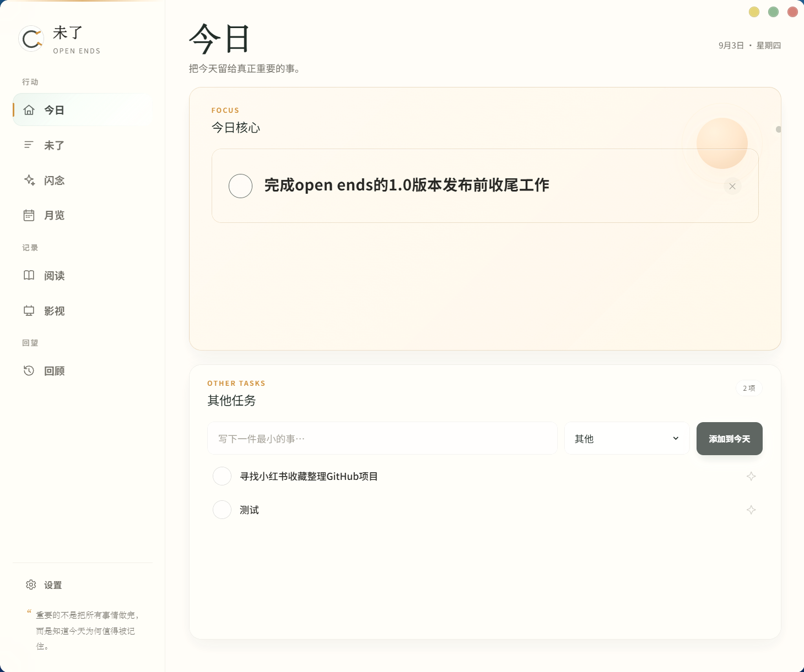
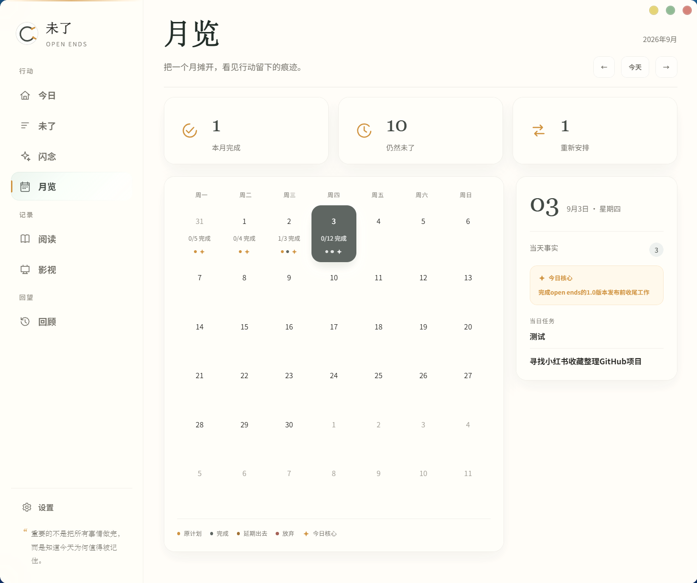

# 未了 Open Ends

> 重要的不是把所有事情做完，而是知道今天为何值得被记住。

Open Ends 是一款 local-first Windows 桌面应用，
用「今日 / 未了 / 闪念 / 月览 / 阅读 / 影视 / 回顾」
记录行动、选择与长期变化。

当前版本：v1.0.0 · Released

它不是为了制造更多待办，
而是让那些做过、延期、放下和仍未完成的事情，
慢慢形成一条可以回看的生活轨迹。

<p align="center">
  
  
</p>

<p align="center">
  
  
</p>

## 为什么叫「未了」

并不是所有事情都必须完成。

有些事会延期，有些会被放下，
有些兴趣过了一阵又重新回来。

Open Ends 保留这些没有立刻闭合的东西，
因为它们同样构成一个人的生活轨迹。

## 核心体验

- **今日**：每天只选一件真正重要的事作为 Daily Focus。
- **未了**：看见仍在进行、被延期和暂时没有收口的事情。
- **闪念**：先用自然语言记下来，再由 AI 整理为任务、阅读或影视。
- **月览**：把一个月摊开，看见行动、延期和 Focus 留下的痕迹。
- **阅读 / 影视**：保存长期文化选择、状态与喜好。
- **回顾**：从周、月、年以及生活画像中，看见长期轨迹。

### 闪念如何变成行动

闪念页面先保留原文，再展示 AI 的整理结果。确认后，用户可以把它分配为任务、阅读或影视；最终记录仍由用户确认，本地数据不会被 AI 静默改写。

<p align="center">
  
</p>

## Local-first & Privacy

Open Ends 的核心数据保存在用户本机：

- SQLite 本地存储；
- 无需注册账号；
- 无 Open Ends 云同步；
- 支持 JSON 备份与恢复；
- DeepSeek / TMDB 凭据由 Windows Credential Manager 保管。

任务、完成、延期、放下、阅读与影视等事实层不依赖 AI。
只有在用户主动使用整理、回顾或画像等 AI 功能时，
相关事实才会发送给对应服务。

## AI 如何参与

AI 在 Open Ends 中是辅助层，而不是事实来源。

它主要用于：

- 整理 Spark；
- 生成周 / 月 / 年回顾；
- 生成 Living Profile。

最终任务、日期、完成、延期、放下、阅读与影视记录，
仍由本地数据决定。

## 下载与安装

Windows 10 / 11 x64。

正式 GitHub Release 提供 Windows x64 安装包，推荐普通用户下载 NSIS 安装包：

- [Open.Ends_1.0.0_x64-setup.exe](https://github.com/yangjuxianabc-source/open-ends/releases/download/v1.0.0/Open.Ends_1.0.0_x64-setup.exe)

同时提供：

- [Open.Ends_1.0.0_x64_en-US.msi](https://github.com/yangjuxianabc-source/open-ends/releases/download/v1.0.0/Open.Ends_1.0.0_x64_en-US.msi)

> 当前 Windows 安装包尚未进行代码签名，首次安装时 SmartScreen 可能显示提醒。

## 外部服务与配置

- **DeepSeek**：Spark AI 整理、Review、Living Profile；
- **TMDB**：影视搜索；
- **Google Books**：图书匹配。

DeepSeek / TMDB 由用户自行配置，凭据保存在 Windows Credential Manager。
Google Books 使用 Release 构建配置；README、Git 和日志中不包含任何 Secret 或内部 Key。

## 技术栈

- Tauri 2
- React 19
- Next.js 16 static export
- TypeScript
- Rust
- SQLite

## 本地开发

桌面开发：

```powershell
npm install
npm run tauri dev
```

浏览器预览：

```powershell
npm run dev
```

浏览器预览不是正式 SQLite 桌面运行环境。

验证：

```powershell
npm run lint
npm run typecheck
npm test
npm run build
cargo test --manifest-path src-tauri/Cargo.toml
```

## Roadmap

### 1.0 — Released

核心产品闭环与 Classic Edition：今日、未了、闪念、月览、阅读、影视、回顾，以及 Windows 桌面壳。

### 1.1

任务效率增强：

- 批量处理；
- 复制任务；
- 导入 / 导出；
- 剪贴板批量输入。

### Later

- New Themes；
- New Editions；
- macOS exploration。

详细路线见 [`docs/ROADMAP.md`](docs/ROADMAP.md)。

## License

Open Ends 采用 MIT License。完整条款见根目录 [`LICENSE`](LICENSE)。
